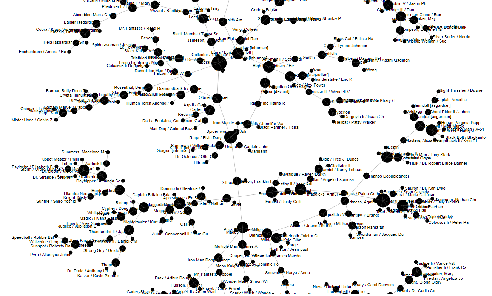
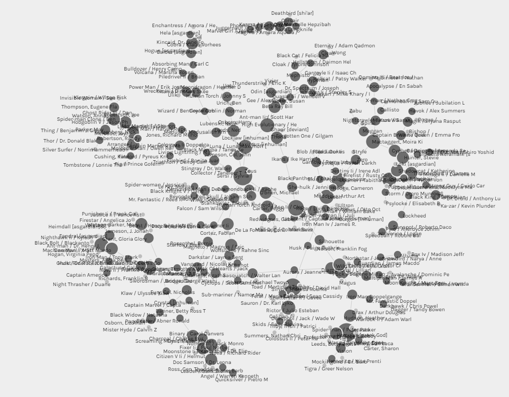
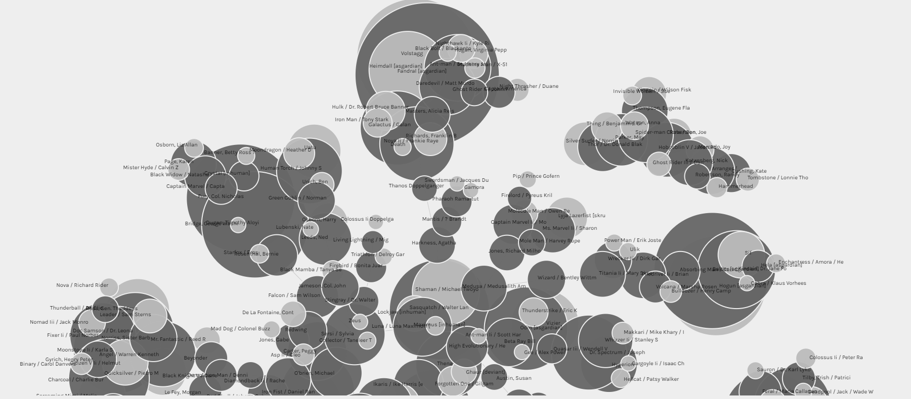

For this assignment, I used the Marvel sample dataset from Melanie Walsh's repository. I loaded the files into Palladio.

The first image demonstrates the connections between Marvel characters and their appearances in Marvel comic book universe. 

Figure 1. Number of Edges

Figure 2. Number of Nodes 

Figure 3. Sum of Weight (from edges table)
