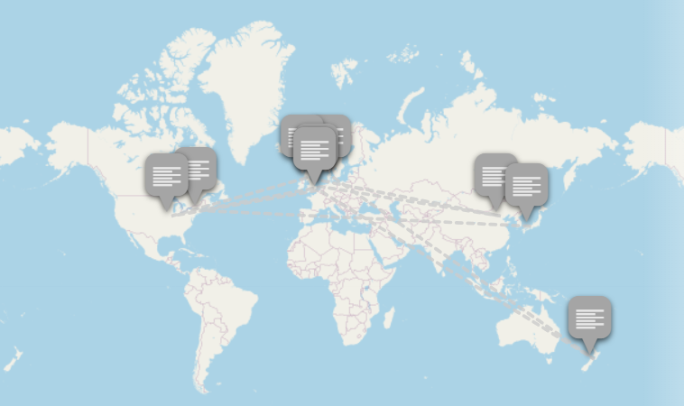
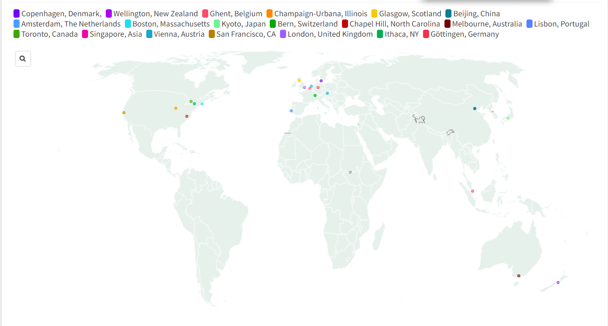

I used Story Map using data from the iPRES conferences. I was able to get the coordinates of the locations of the conference using the Geocoding extension on Google Sheets.
Using Story Map was a simple process and I appreciated the visuals and seamless transitions! (https://uploads.knightlab.com/storymapjs/c2a0001ddbe340e8648de5f326c847e0/map-of-ipres-conferences/index.html)
This file can be embedded. 

I also loaded this data into Flourish which was easier to use and provided a lot more display options (that I could easily configure at least). This file can also be embedded.
https://public.flourish.studio/story/2077771/

I attempted to use geojson.io but I was unable to open the CSV file, but did not have any luck. 
I asked Chatgpt to help create a geojson file but couldn't figure out the error in the code. 

